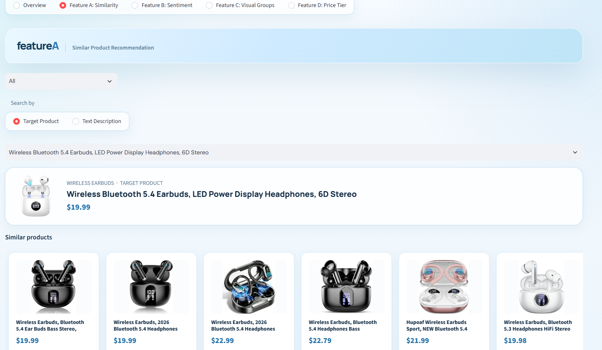
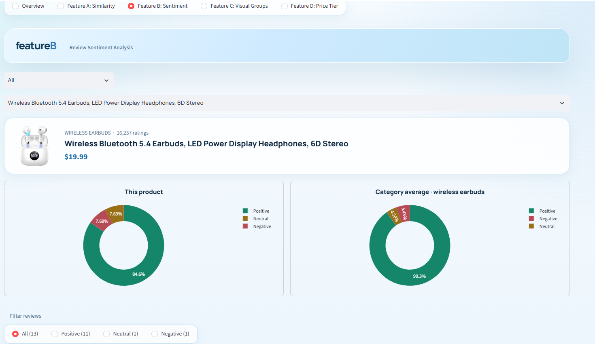
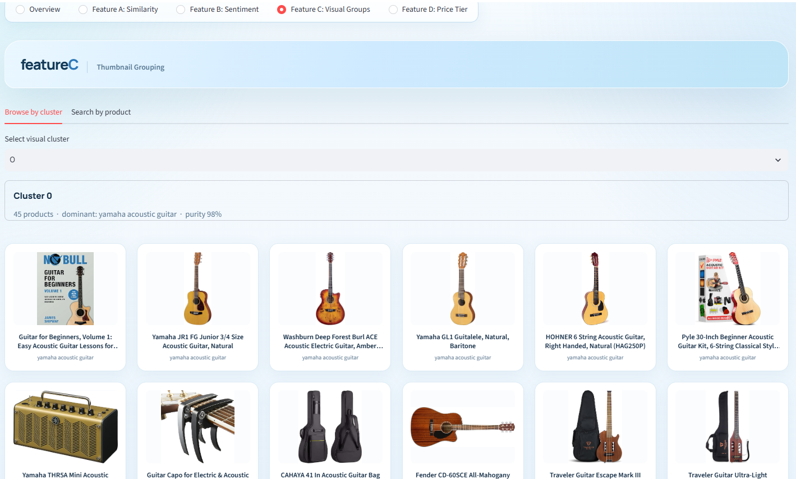
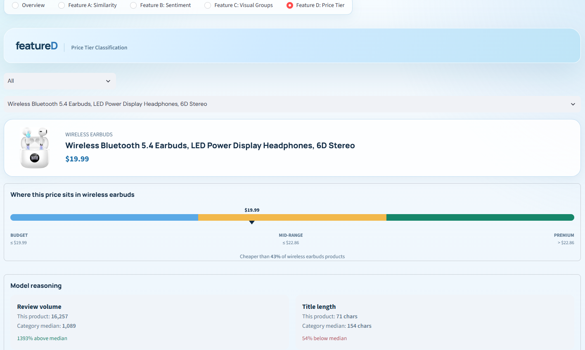

# 🛒 Amazon Marketplace Product Intelligence Platform


An end-to-end marketplace intelligence platform that scrapes live Amazon product and review data, turns it into four independent ML-driven analytical features, and serves everything through a single Streamlit application.

---

## 👨‍💻 Author

**Ahsan Rizvi**

---

## 📌 What This Project Does

The platform automatically collects product and customer review data from Amazon and provides analytical insights through a single Streamlit app. It covers the full pipeline — scraping, cleaning, modeling, and deployment:

1. **Data Collection Pipeline** — Playwright-driven scraper that collects fresh product and review data across 28 assigned search keywords.
2. **Data Preparation & Analysis** — cleans, deduplicates, imputes, and translates the collected data into a modeling-ready dataset.
3. **Four Analytical Features:**
   - **A — Similar Product Recommendation:** recommends related products using TF-IDF, sentence embeddings, and a hybrid retrieval model.
   - **B — Review Sentiment:** classifies reviews as positive, neutral, or negative and rolls them up into per-product and per-category summaries.
   - **C — Thumbnail Grouping:** groups product images into visually coherent clusters using CLIP embeddings.
   - **D — Price Tier Classification:** predicts budget / mid-range / premium tiers from product attributes — without ever looking at the price.
4. **Streamlit Application** — product browsing, product detail views, and interactive access to all four features.

---

## 🏗️ System Architecture

The pipeline runs in four stages, from raw HTML on Amazon to an interactive dashboard:

```
Amazon Search & Product Pages
        │  (Playwright scraper, polite rate limiting)
        ▼
Raw Data (JSON / CSV) ── 1,028 products · 11K+ reviews
        │  (dedup, price imputation, language detection + translation)
        ▼
Cleaned Dataset (products_cleaned.json/csv)
        │
        ├──▶ Feature A — TF-IDF + Sentence Embeddings ──▶ Similarity model
        ├──▶ Feature B — TF-IDF + Logistic Regression ──▶ Sentiment model
        ├──▶ Feature C — CLIP ViT-B/32 + KMeans ────────▶ Visual clusters
        └──▶ Feature D — TF-IDF + Random Forest ────────▶ Price-tier model
        │
        ▼
Streamlit Application (app/main.py)
```

---

## 📊 Data Pipeline

| Stage | Detail |
|---|---|
| **Search keywords** | 28, spanning electronics, kitchen, fashion, and lifestyle categories |
| **Products collected (raw)** | 1,028 |
| **Products after cleaning** | 1,005 |
| **Reviews flattened** | 11,288 |
| **Prices imputed (missing)** | 149 of 1,005 (flagged, excluded from tier-boundary calculation) |
| **Non-English reviews** | detected and machine-translated during cleaning |
| **Product images downloaded** | 1,004 of 1,005 |

Every request (search and product page) is logged to `logs/scraping_log.csv` with timestamp, outcome, and any error — used to monitor scraper health across the 28-keyword run.

---

## 🔍 Feature A — Similar Product Recommendation

Three retrieval approaches were built on top of a combined title + brand + bullet-point text field, then benchmarked head-to-head:

| Method | Precision@5 (28 queries, human-judged) |
|---|---|
| **Hybrid (TF-IDF + embeddings)** | **0.864** |
| TF-IDF (5,000 features, 1–2 grams) | 0.850 |
| Sentence embeddings (`all-MiniLM-L6-v2`) | 0.821 |

211 unique query/result pairs were manually judged for relevance (80.6% found relevant) to compute Precision@5. TF-IDF was shipped to production since it matched the hybrid model's precision within noise while avoiding an embedding model at inference time. The app also supports free-text search against the same index.



---

## 💬 Feature B — Review Sentiment Analysis

Reviews were weakly labeled from star ratings (positive/neutral/negative), then checked against a 180-review manually labeled gold set to see how well that heuristic — and several trained classifiers — actually held up:

| Model | Accuracy | Macro-F1 |
|---|---|---|
| **Star-rating baseline** | **0.889** | **0.887** |
| TF-IDF + Logistic Regression (leakage-free) | 0.633 | 0.577 |
| VADER | 0.533 | 0.456 |
| Transformer (`cardiffnlp/twitter-roberta-base-sentiment`) | 0.678 | 0.623 |

The star-rating-derived label outperformed every trained text classifier against the manual gold set, so it's what powers the sentiment shown in the app, with per-product and per-category positive/neutral/negative breakdowns. The trained TF-IDF classifier is kept as an artifact for scoring future reviews that may arrive without a star rating.



---

## 🖼️ Feature C — Thumbnail Grouping

Product thumbnails were embedded with **CLIP (ViT-B/32)** and clustered to group visually similar products, independent of their search category:

| Method | Clusters | Silhouette | Notes |
|---|---|---|---|
| **KMeans (k=25)** | 25 | 0.174 | Selected — clean, fully-assigned clusters |
| Agglomerative | 25 | 0.164 | Comparable, slightly lower silhouette |
| DBSCAN | 19 | 0.373 | Best silhouette, but left 853/1,004 products unassigned as noise |

k=25 was chosen via a silhouette sweep across k=5–40. Cluster quality was cross-checked against the original 28 search categories: **ARI 0.79 / NMI 0.87**, confirming the visual clusters largely track real product categories while still surfacing meaningful cross-category groupings (e.g., visually similar accessories from unrelated keywords).



---

## 🏷️ Feature D — Price Tier Classification

Budget / mid-range / premium tiers are defined **within each category** using price terciles (so "premium" means something different for a phone case than for a DSLR camera), then predicted using only non-price signals — title/brand/bullet text, category, rating, and review count — to avoid leaking the price into the prediction:

| Model (5-fold CV, selected on training data only) | CV Macro-F1 | Test Accuracy | Test Macro-F1 |
|---|---|---|---|
| **Random Forest** | **0.509** | 0.421 | 0.406 |
| Gradient Boosting | 0.498 | — | — |
| Logistic Regression | 0.482 | — | — |
| Baseline (most frequent class) | — | 0.346 | 0.171 |

Random Forest was selected by cross-validation and evaluated once on a held-out test set. A macro-F1 of 0.41 against a 0.17 baseline shows genuine (if modest) signal in product text and metadata for price positioning — reflecting how much price within a category is driven by factors beyond what a listing's text reveals.



---

## 💻 Streamlit Application

The app ties all four features together into one browsing experience:

- **Overview** — browse the full product catalog with category filtering.
- **Feature A: Similarity** — search by an existing product or free text, with similarity scores and shared-term explanations.
- **Feature B: Sentiment** — per-product sentiment breakdown with filterable, expandable individual reviews.
- **Feature C: Visual Groups** — browse by visual cluster or find the cluster for a given product.
- **Feature D: Price Tier** — predicted tier for any product, with the model's confidence.

---

## 🚀 Setup

```bash
python -m venv venv
venv\Scripts\Activate.ps1
pip install -r requirements.txt
```

Run the application:

```bash
streamlit run app/main.py
```

---

## 📁 Project Structure

```text
├── product_images/   Downloaded product thumbnails
├── notebooks/        Data cleaning + feature A–D development notebooks
├── src/              Data collection pipeline (Playwright)
├── screenshots/      App screenshots used in this README
├── data/             Raw and cleaned datasets
├── app/              Streamlit application
├── models/           Saved model artifacts and evaluation results per feature
├── logs/             Scraping request logs
├── requirements.txt
├── README.md
└── .gitignore
```

---

## ⚙️ Constraints

- Publicly accessible pages only.
- No login or CAPTCHA bypassing.
- Modest request rates, with a randomized polite delay between requests.
- No personal data beyond publicly displayed reviewer names.

---

## 📜 License & Attribution

This project is released under the Creative Commons Attribution-NonCommercial 4.0 International (CC BY-NC 4.0) license.

You are free to:

- **Share** — copy and redistribute the material in any medium or format.
- **Adapt** — remix, transform, and build upon the material.

Under the following terms:

- **Attribution (Credit Required):** You must give appropriate credit to the original author (**Ahsan Rizvi**), provide a link to this repository, and indicate if changes were made.
- **NonCommercial:** You may not use the material for commercial purposes without explicit permission.

If you utilize this code in your own research or project, please cite: **Rizvi, A. (2026). Amazon Marketplace Product Intelligence Platform. GitHub Repository.**


